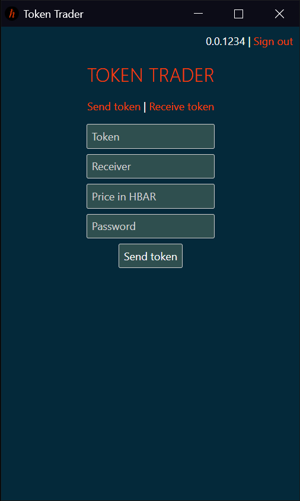
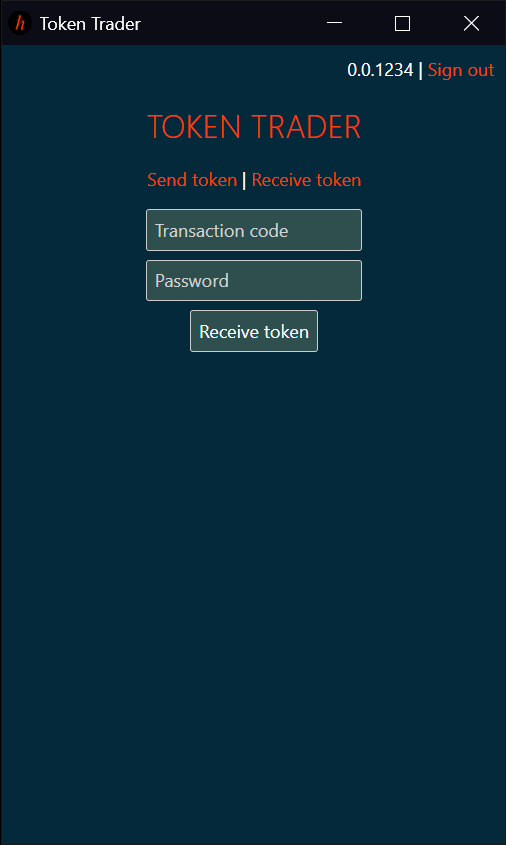

# Token Trader

## Table of Contents

- [About](#about)
- [Screenshots](#screenshots)
- [Instructions](#instructions)
- [Fees](#fees)
- [License](#license)
- [Website](#website)
- [Contact](#contact)

## About 

Token Trader is a decentralized application browser extension that allows users to trade an NFT or a fungible token in return for HBAR, securely and easily. The dApp supports NFTs with royalties, as well as fungible tokens such as GoMint tokens. Token Trader is available for Chrome and Brave in the Chrome Web Store.

## Screenshots 

## Instructions 

### Send a token
Once logged in, fill up the form with the details of the trade, enter your password and submit. Copy the code that appears and send it to your trade party.

### Receive a token
Click on `Receive token` and paste the code you received from your trade party. The details of the trade should appear on screen. Review the trade, then enter your password and submit the form to perform the trade. Token association is performed automatically if needed, so there's no need to think about it.

## Fees 

- For trades below a 1000 HBAR the fee is 1% paid by the receiver of the token
- For trades above a 1000 HBAR the fee is fixed to 10 HBAR
- For trades of 0 HBAR the fee is fixed to 0.01 HBAR

In addition, [Hedera fees](https://hedera.com/fees) for executing a transaction and (if needed) for token association also apply.

## Security 

Token Trader is a completely non-custodial dApp. The private key is encrypted using AES and a salted password of at least 12 characters. A password is required in order to send or receive tokens.

To clear a record of an account from the extension records, or to clear all records, go to the options page, available by right clicking the extension icon.

## License 

The code for Token Trader is provided for transparency, so people in the community could review it. Using the code or parts of it in any way is prohibited, without explicit permission from the author.

## Website 
[token-trader.netlify.app](https://token-trader.netlify.app/)

## Contact 

tokentraderapp at gmail dot com
